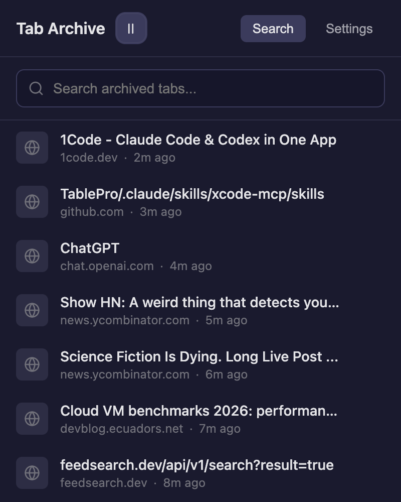

# Tabarchive

Tabarchive is a browser extension plus a native messaging host for local tab
archiving. It gives you recent archived tabs, full-text search, and archive
management from a single popup while keeping the archive on your machine.

## Supported platforms

Tabarchive supports macOS and Linux. The native install scripts and CI cover
those platforms only.

## Local install

Use the repository install flow when you want a working development setup.
The native installer copies the host into `~/.tabarchive/bin/` and registers
the browser manifests from there.

For Firefox:

1. Run `native/install.sh --browser firefox`.
2. Build the extension from `extension/`.
3. Load `extension/dist/manifest.json` as a temporary add-on, or load the
   packaged `.xpi` in Firefox Developer Edition.

For Chrome or Chromium:

1. Build the extension from `extension/`.
2. Load `extension/dist` as an unpacked extension.
3. Copy the extension ID from the browser.
4. Run `native/install.sh --browser chrome --extension-id <id>`.

Use `--browser chromium` or `--browser chrome-for-testing` for those channels.

## Development

Run extension commands from `extension/`. Use the following commands during
local development:

- `npm ci`: install locked extension dependencies.
- `npm run dev`: build the Firefox development bundle.
- `npm run build`: build the Firefox production bundle.
- `npm run build:chromium`: build the Chromium production bundle.
- `npm test`: run the extension unit tests.
- `python3 -m pytest native/tests -q`: run the native host test suite.

## Releases

GitHub Releases publish unsigned Firefox `.xpi` and Chromium `.zip` artifacts.
They are developer-focused build outputs, not one-click end-user installers.
You must still install the native host from this repository before using the
extension.

## Data and privacy

Tabarchive stores its database and native host files under `~/.tabarchive/`.
The archive persists across browser data clears because it lives outside the
browser profile. Private or incognito tabs are not archived.

## License

This project uses the MIT License. See [`LICENSE`](LICENSE).
